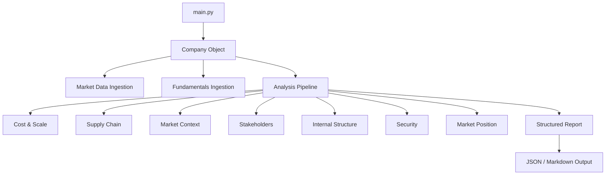

# 🧩 Architecture Diagram 

📄 **diagrams/architecture.md**

```mermaid
graph TD
    A[main.py] --> B[Company Object]

    B --> C[Market Data Ingestion]
    B --> D[Fundamentals Ingestion]

    B --> E[Analysis Pipeline]

    E --> F[Cost & Scale]
    E --> G[Supply Chain]
    E --> H[Market Context]
    E --> I[Stakeholders]
    E --> J[Internal Structure]
    E --> K[Security]
    E --> L[Market Position]

    E --> M[Structured Report]
    M --> N[JSON / Markdown Output]
```
