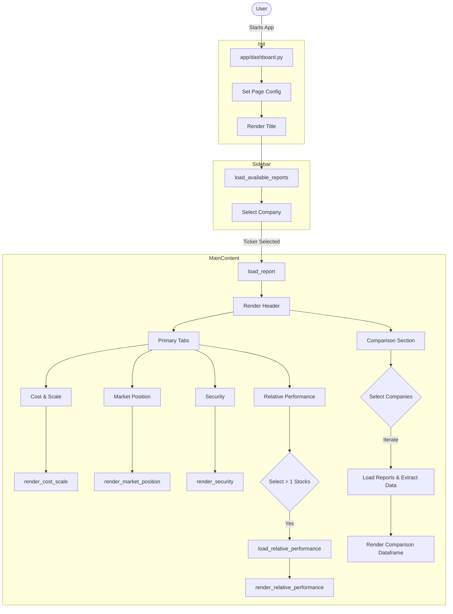

# 📊 Streamlit Dashboard Flow

📄 **diagrams/streamlit_flow.md**

```mermaid
graph TD
    User([User]) -->|Starts App| Main[app/dashboard.py]
    
    subgraph Init
    Main --> Conf[Set Page Config]
    Conf --> Title[Render Title]
    end

    subgraph Sidebar
    Title --> LoadTicker[load_available_reports]
    LoadTicker --> Select[Select Company]
    end

    Select -->|Ticker Selected| LoadRep[load_report]

    subgraph MainContent
    LoadRep --> Header[Render Header]
    Header --> Tabs1[Primary Tabs]
    
    Tabs1 --> T1[Cost & Scale]
    Tabs1 --> T2[Market Position]
    Tabs1 --> T3[Security]
    Tabs1 --> T4[Relative Performance]

    T1 --> R1[render_cost_scale]
    T2 --> R2[render_market_position]
    T3 --> R3[render_security]
    
    T4 --> Multi1{Select > 1 Stocks}
    Multi1 -->|Yes| RelData[load_relative_performance]
    RelData --> RelRender[render_relative_performance]

    Header --> Tabs2[Comparison Section]
    Tabs2 --> Multi2{Select Companies}
    Multi2 -->|Iterate| CompLoop[Load Reports & Extract Data]
    CompLoop --> CompTable[Render Comparison Dataframe]
    end
```
